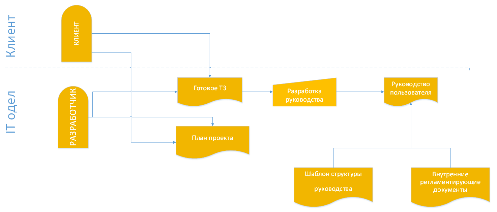
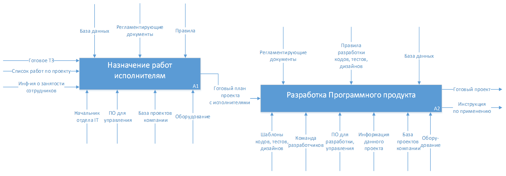

# Модель бизнес-процесса "Разработка ПО"
Далее будут представлен разбор бинес-процесса: Разработка программного продукта.

## Схема документооборота

### Действующая схема документооборота

### Будущий планируемый маршрут плана проекта по контрольным точкам

## Оценка KPI
Оценка требуемых KPI и определение необходимых КФУ для достижения соответствующих KPI.

## Модель бизнес-процесса «как есть» в нотации BPMN

.png "Рисунок 4. Модель бизнес-процесса «как есть» в нотации BPMN")

### Проблемы описанного бизнес-процесса
На диаграмме as-is «Разработка программного продукта» представлен процесс, действующий на данный момент в компании. У данного процесса имеются значительные недостатки:

#### 1. Отсутствие расстановки приоритетности задач
В начале разработки происходит «назначение работ исполнителям» без выбора приоритетных важных задач, то есть каждый член команды хаотично выбирает с реализации какого функционала ему начать, может получиться так, что заказчику не хватит денег на полноценное завершение разработки и ему потребуется получить часть основного функционала системы, но такой функционал может даже не быть разработан, так как приоритета у задач не было.

#### 2.	Отсутствие возможности выбора требуемых желаемых разработчиков
В данном процессе отсутствует список требуемых желаемых разработчиков для проекта, что снижает качество выполняемой работы, так как, возможно, есть специалисты, разбирающиеся в одной области лучшем остальных. 

#### 3.	Нецелесообразные простои процесса
Из диаграммы видно, что в разработке обычно присутствуют три основных этапа разработки: дизайнерский проект, программный код и тестирование системы. На данный момент процесс разработки организован таким образом, что разработка программистами не начнётся до тех пор, пока не будет выполнен весь дизайнерский проект, аналогично, пока не будет написан весь программный код системы, тестироваться работоспособность не будет, а также и тесты для системы не будут еще разработаны. Из этого видны нецелесообразные ресурсозатратные «простои» техники, вычислительных мощностей, бездействие разработчиков проекта. 

#### 4.	Подготовка проекта к презентации ведется не компетентными субъектами
Подготовка проекта к презентации осуществляется командой тестировщиков, а они могут быть не осведомлены в полной мере функционалом системы, целями, которые будут решены при помощи системы.

#### 5.	Повторение процесса снова
На самом последнем этапе происходит проверка работы Начальником IT отдела, то есть до этого момента работу команды никто не контролировал, поэтому вероятнее всего работу примут не с первого раза.

#### 6.	Заказчик не имеет возможности следить за процессом
Нет отлаженной автоматизированной системы для отслеживания процесса разработки процесса.

#### 7.	Отсутствие руководства по эксплуатации
В разработку программного продукта не входит разработка документации, инструкций для пользователей, что значительно снижает эффективность применения системы.

## Модель «как должно быть»

### Предлагаемое решение проблем
Решением вышеперечисленных проблем является модернизация текущего бизнес-процесса, его оптимизация и улучшение, а именно:

#### 1.	Отсутствие расстановки приоритетности задач
**Решение:** Предусмотреть ответственного за данный этап процесса. Суть действия заключается в расстановке задач по приоритетности, и необходимости начать разработку с основных, более приоритетных задач.
#### 2.	Отсутствие возможности выбора требуемых желаемых разработчиков
**Решение:** Предусмотреть составление графика потребностей, отслеживание занятости специалистов посредством информационной базы с информацией о проектах, и другие необходимые манипуляции для достижения наиболее выводного и желаемого результата по формированию команды исполнителей.
#### 3.	Нецелесообразные простои процесса
**Решение:** Все три ветки разработки начинают работу одновременно с тех функциональности, которые могут изначально работать изолированно друга от друга, в процессе соединяя разработки.
#### 4.	Подготовка проекта к презентации ведется не компетентными субъектами
**Решение:** данным этапом теперь будет заниматься Ведущий разработчик проекта, так как он наиболее осведомлен о свойствах системы, ее функционале, а также о всех действиях своей команды.
#### 5.	Повторение процесса снова
**Решение:** Ведущий разработчик проекта будет на протяжении всего цикла разработки координировать действия команды, помогая и контролируя их действия по проекту, что снизит вероятность переработки проекта в конце.
#### 6.	Заказчик не имеет возможности следить за процессом
**Решение:** На каждом этапе разработки, а также на каждом прохождении какой-то значимой точки по разработке проекта ответственные каждого сегмента разработки (Ведущий разработчик проекта, дизайнеры, программисты и тестировщики) фиксируют в информационной системе, что позволяет точно отслеживать процесс разработки клиенту в любое время, а также предусмотрено общение заказчика с аналитиком компании разработчика для выяснения интересующих его вопросов.
#### 7.	Отсутствие руководства по эксплуатации
**Решение:** Внедрение такого этапа разработки, как подготовка руководства пользователя, что значительно повышает знания заказчика о системе, тем самым повышая эффективность применения разрабатываемой системы.

### Модель бизнес-процесса «как должно быть» в разных нотациях
Ниже представлены диаграммы модели процессов «как должно быть» в разных нотациях. 

#### Модель бизнес-процесса «как должно быть» в нотации BPMN

.png "Рисунок 5. Модель бизнес-процесса «как должно быть» в нотации BPMN")
Подпроцесс "Назначение работ исполнителям":

.png "Рисунок 6. Модель бизнес-процесса «как должно быть» в нотации BPMN")
Подпроцесс "Разработка проекта":

.png "Рисунок 7. Модель бизнес-процесса «как должно быть» в нотации BPMN")

#### Модель бизнес-процесса «как должно быть» в нотации IDEF0

Подпроцессы "Назначение работ исполнителям" и "Разработка ПП":

Подпроцесс "Назначение работ исполнителям":

Подпроцесс "Разработка ПП":

#### Модель бизнес-процесса «как должно быть» в нотации eEPC
В eEPC представлен только первый этап "Назначение работ исполнителям", так как данная нотация представлена здесь в качестве ознакомления.

