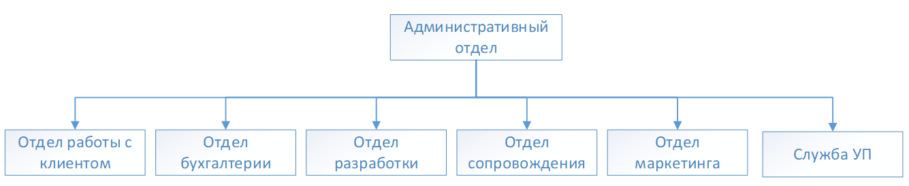
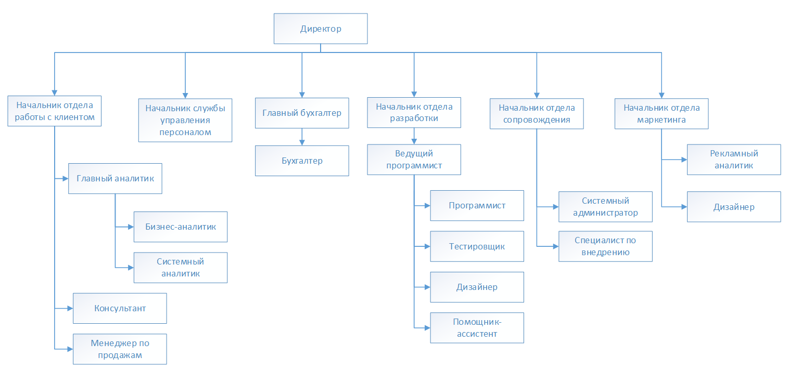
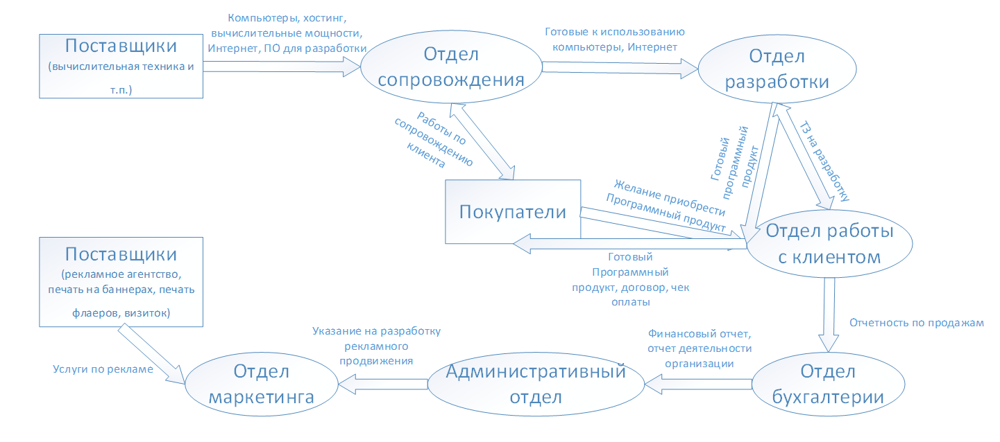
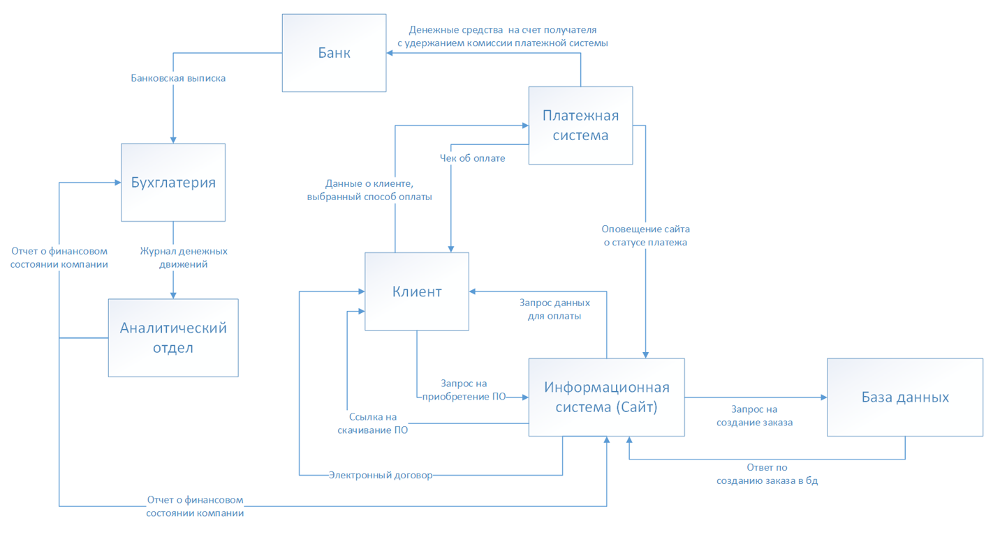
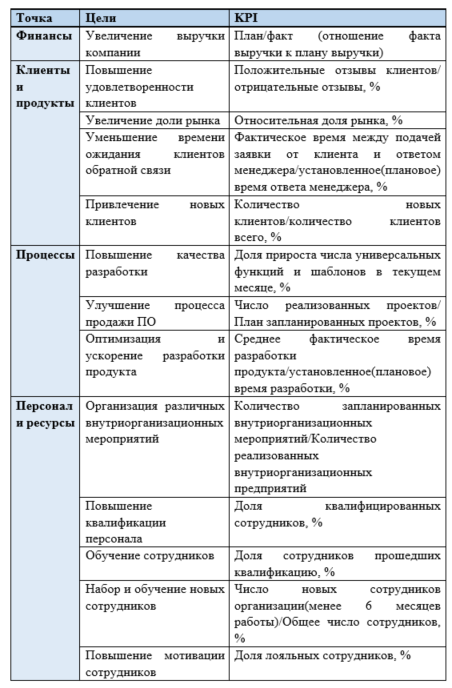
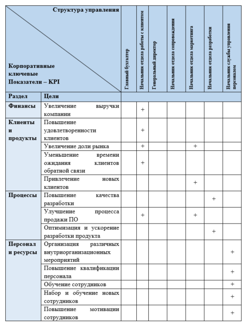
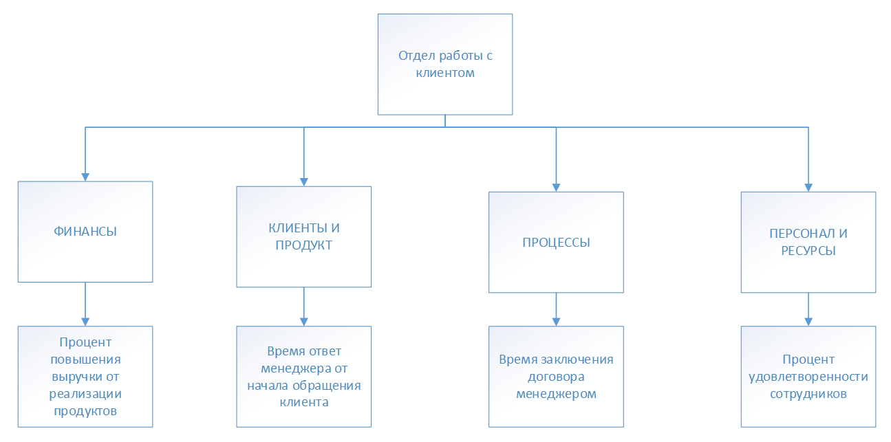
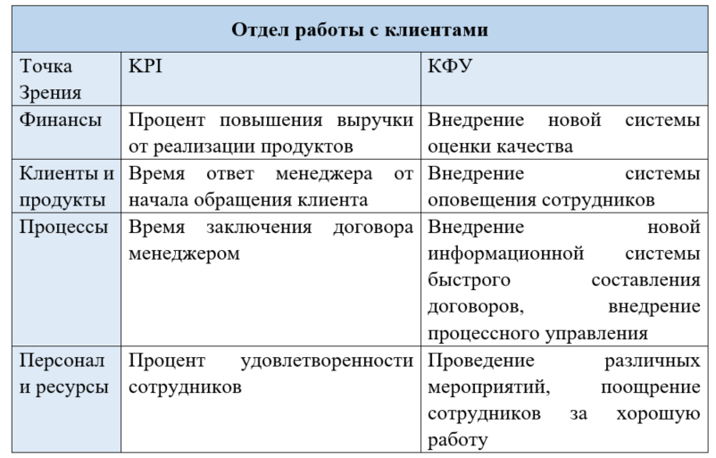
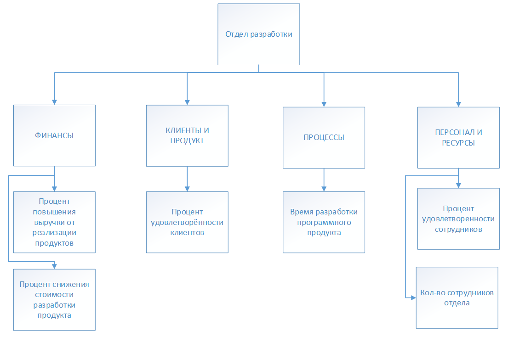
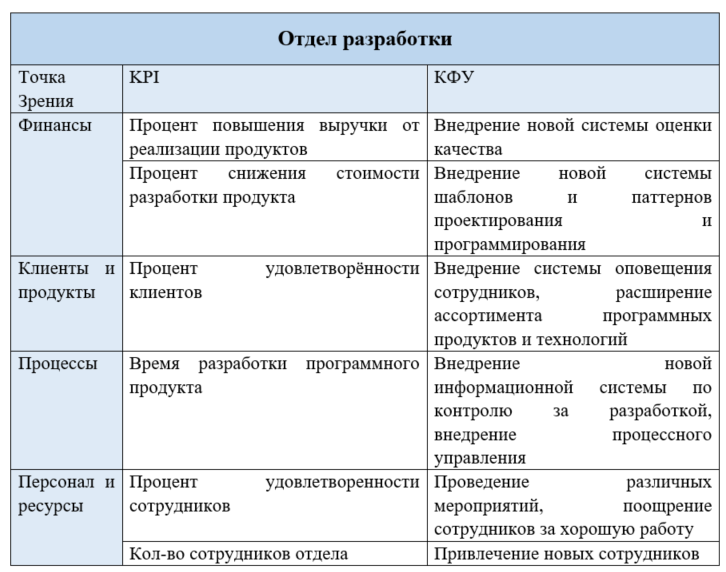

# Организационно-функциональная структура предприятия

## Организационная структура

## Структура управления организацией
 

## Схема материальных потоков

## Схема информационных потоков

## Измеримые показатели деятельности для стратегических целей компании 
### Схема информационных потоков

### Матрица ответственности за KPI 

### Критерии эффективности (KPI) работы подразделений 
#### KPI отдела работы с клиентами 

#### КФУ отдела работы с клиентами
Анализ наиболее значимых факторов (КФУ), влияющих на текущие результаты работы KPI отдела работы с клиентами представлен в таблице ниже.

#### KPI отдела разработки 

#### КФУ отдела разработки
Анализ наиболее значимых факторов (КФУ), влияющих на текущие результаты работы KPI отдела разработки предприятия представлен в таблице ниже.

