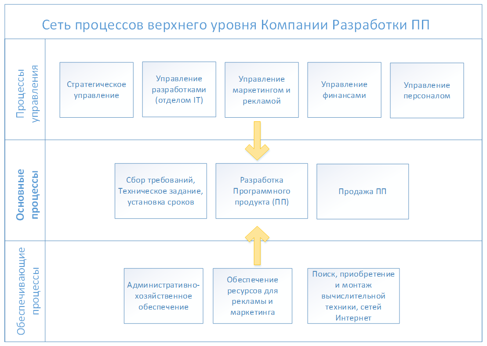
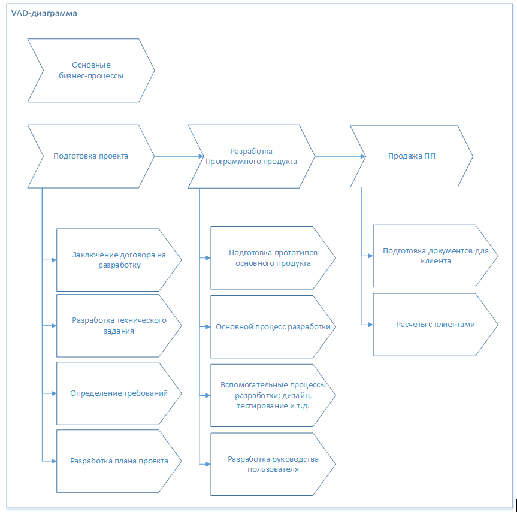
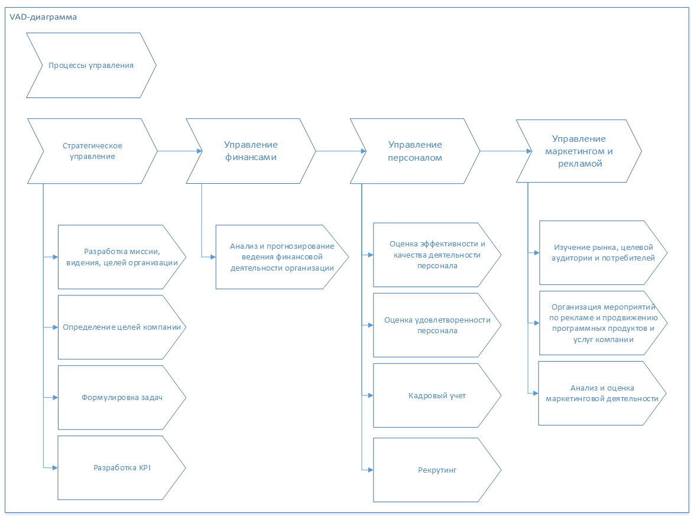
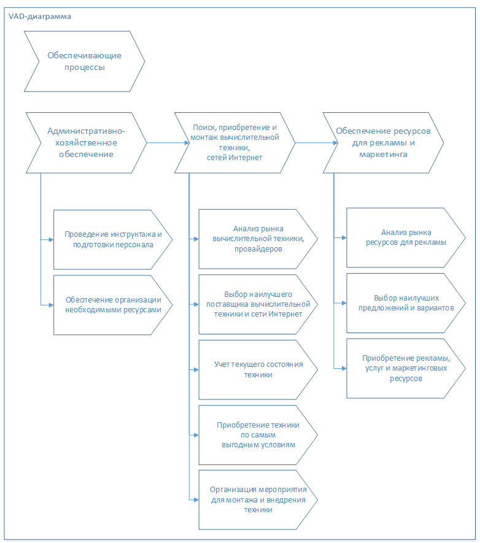

# Процессная модель верхнего уровня работы предприятия

## Сеть процессов верхнего уровня

## Иерархический список процессов/субпроцессов компании
Отображение иерархии подпроцессов для основных процессов предприятия в диаграммах VAD.

### Основные бизнес-процессы

### Процессы управления

### Обеспечивающие процессы
